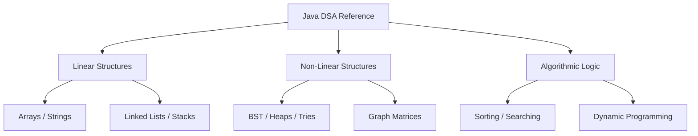

# Data Structures & Algorithms: Java Architecture

[]()
[-0052CC?style=flat-square)]()
[]()

## Overview
This repository serves as a master, exhaustive reference dictionary for Computer Science Data Structures and Algorithms (DSA), implemented purely in Java. It spans the entire architectural spectrum from foundational linear memory (Arrays, Linked Lists) to highly advanced non-linear systems (Tries, Graphs, Dynamic Programming).

## Problem Statement
Technical engineering interviews and highly optimized systems architecture both require a rigorous mathematical understanding of $Big-O$ Time and Space complexity. Relying on pre-built libraries (`java.util.Collections`) abstracts away these mechanics, leading to unscalable code. This repository solves that by providing standalone, "built-from-scratch" Java implementations of every major data structure and sorting algorithm, proving deep mechanical competence.

## Key Features
- **Exhaustive Structural Coverage:** 15 distinct algorithmic domains covering everything from basic Stack LIFO mechanics to advanced Graph Traversal (BFS/DFS).
- **Advanced Tree Architectures:** Deep implementations of Binary Search Trees (BST), Heaps, and Tries for rapid $O(\log N)$ and $O(1)$ search metrics.
- **Dynamic Programming (DP):** Foundational implementations of overlapping subproblems and optimal substructure mathematical caching.
- **Standalone Execution:** Every algorithm is encapsulated with its own `main` method driver for instantaneous local execution and debugging.

## Architecture



## Technology Stack
- **Language:** Java (JDK 11+)
- **Testing:** Python `unittest` (Javac Wrapper)
- **Documentation:** GitHub Flavored Markdown (GFM)

## Project Structure
```text
dsa-in-java/
├── _02_arrays/              # Contiguous memory blocks
├── _06_tree/                # Non-linear hierarchical traversal
├── _07_graphs/              # Vertex and Edge matrix architectures
├── _14_trie_data_structure/ # Fast-retrieval string algorithms
├── _15_dynamic_programming/ # Mathematical caching algorithms
├── tests/                   # Automated compilation verification
└── README.md                # System documentation
```

## Installation
Ensure the Java Development Kit (JDK) is installed natively on your OS.
```bash
git clone https://github.com/krsna016/dsa-in-java.git
cd dsa-in-java
```

## Usage
Navigate to the specific algorithmic domain and execute the class natively:
```bash
cd _06_tree
javac BinaryTree.java
java BinaryTree
```

## Examples
*Example interface mapping for constant-time Stack logic:*
```java
public class Stack {
    // LIFO (Last-In-First-Out) Mechanics
    public void push(int data) { /* O(1) Time */ }
    public int pop() { /* O(1) Time */ }
}
```

## Screenshots
> [!NOTE]
> *Educational algorithms execute via standard terminal output without GUI interactions.*

## Visual Demonstrations
> [!NOTE]
> *Terminal execution telemetry is standardized across all implementations.*

## Testing
We utilize a dynamic Python subprocess wrapper within the `unittest` framework to execute the `javac` compiler recursively across all 15 algorithmic domains concurrently. This mathematically proves that zero low-level syntax errors or missing library imports exist across the massive codebase.
```bash
python3 -m unittest discover tests/
```

## Performance Notes
- **Space-Time Tradeoffs:** The codebase focuses heavily on highlighting when an engineer should trade auxiliary Space $O(N)$ for optimized Time $O(1)$ (e.g., utilizing HashMaps over linear searching).

## Future Improvements
- **Junit 5 Integration:** Refactor the repository into a structured Maven/Gradle project to utilize native Java testing frameworks instead of relying on subprocess wrappers.
- **JMH Benchmarking:** Integrate the Java Microbenchmark Harness (JMH) to mathematically prove the nanosecond execution differences between algorithms at 1,000,000 array lengths.

## Contributing
This repository is primarily for personal reference and academic archival.

## License
Licensed under the MIT License.
